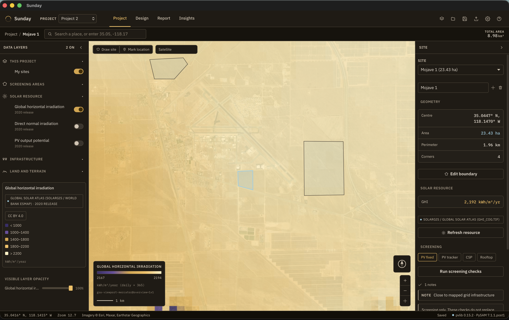
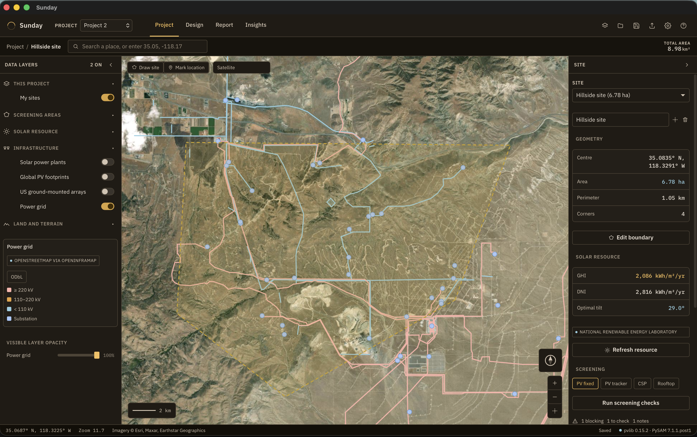
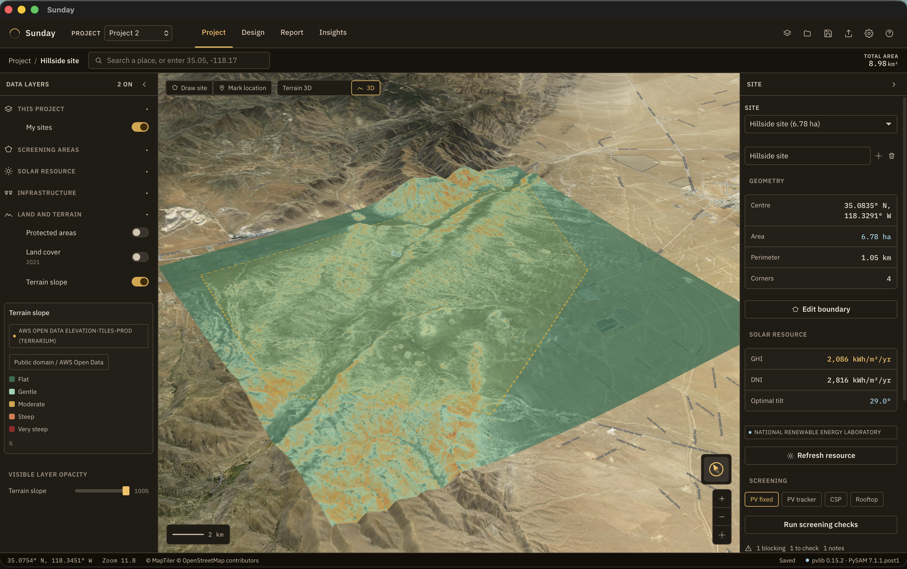
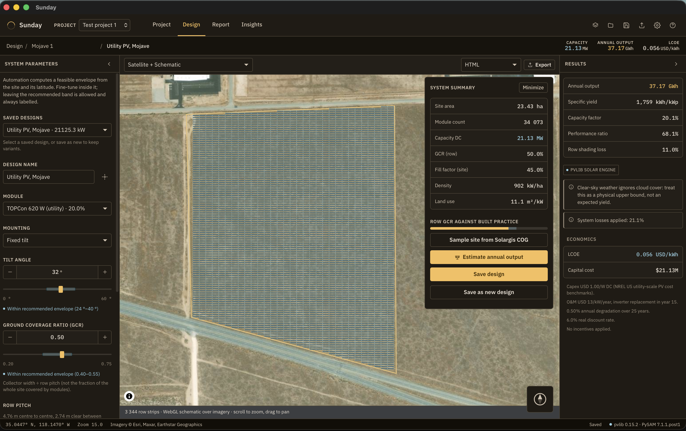
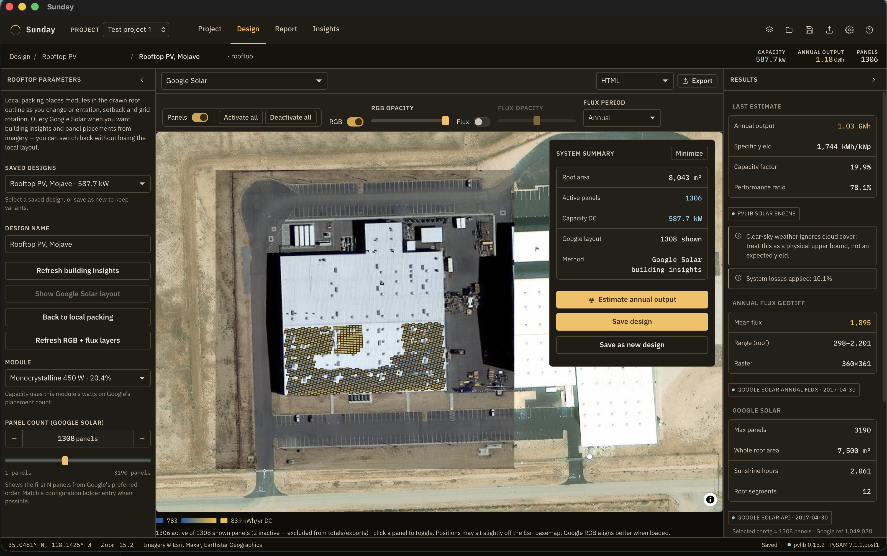
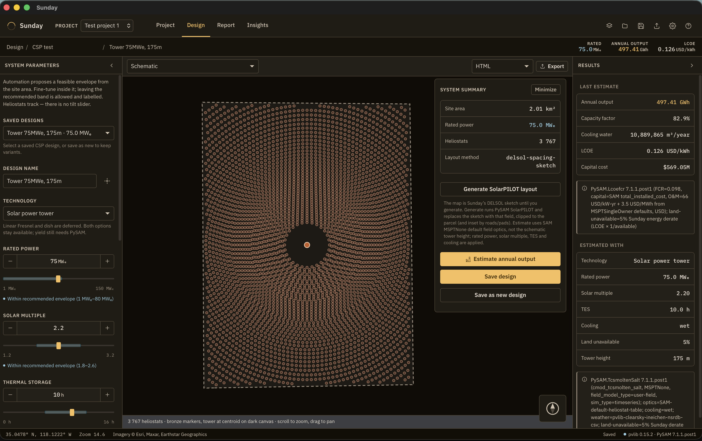
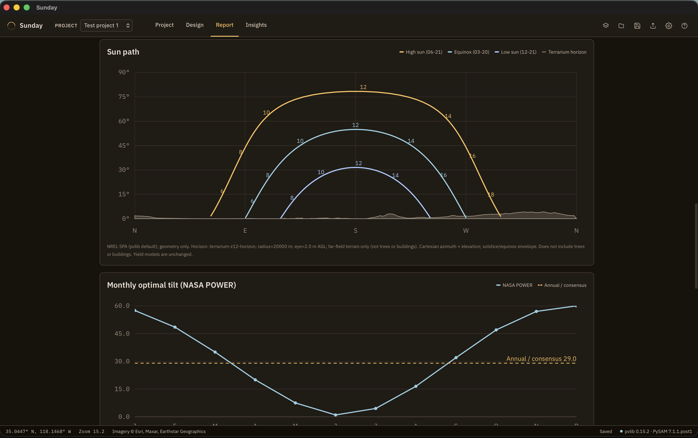

# Sunday

Sunday is a **macOS desktop application** for screening solar sites, designing PV and concentrating solar power (CSP) systems, and estimating long-term yield on a geospatial map. It is a **design and planning tool**, not a monitoring dashboard and not a bankable energy-yield assessment.

This repository is **developer beta v0.1**. The app is run locally from the terminal (Vite UI, Python solar engine, optional Tauri shell). It is intended for **non-commercial use**. Third-party datasets and APIs keep their own licences (several are CC BY-NC or WDPA non-commercial).

Sunday is **not a web product**: no Next.js, no serverless backend, no cloud deploy. The UI can still run in a browser via Vite so the interface can be developed without a Rust rebuild.

## UI









---

## What it does

Typical workflow:

1. **Screen** — Draw screening areas on the map, paint resource and infrastructure layers, mark locations or site polygons, fetch irradiation, run screening checks.
2. **Select** — Compare sites in the inspector and in Insights → Portfolio. Blocking flags (protected areas, slope, resource floors) stay visible.
3. **Design** — For a selected site, choose the System family and open Design: greenfield PV packing, rooftop PV (Google Solar when keyed), or CSP (power tower / parabolic trough).
4. **Estimate** — Run the local solar engine for modelled PV yield or PySAM CSP annual energy, LCOE and capital cost. Export HTML / CSV / GeoJSON / JSON.
5. **Report** — Multi-source climatology, sun-path diagram with far-field terrain horizon, cloud amount, provenance.

Automation **proposes**; you **dispose**. Envelopes show a feasible range, not a single opaque answer. Disagreeing data sources are shown side by side, never silently averaged.

---

## Quick start (workflows)

**Screen a region.** Open **Project**. Draw a screening area if you want windowed map layers. Toggle Solar Resource (GHI / DNI / PVOUT), plants, grid, protected areas, land cover, or slope in the left panel. Layers that need a file or a key explain what is missing.

**Add a site.** Draw site (click corners, Enter or click the first corner to finish; Escape cancels) or Mark location. Fetch solar resource (PVGIS and NASA POWER need no key; NREL needs a key). Run screening checks with a profile: PV fixed, PV tracker, CSP, or rooftop. That chip is saved on the site and is independent of Design’s System family.

**Design.** In the inspector, set System to PV, Rooftop PV, or CSP, then open **Design**.

- **Greenfield PV** — envelope sliders (tilt, azimuth, GCR, BOS), schematic / satellite / blend, Estimate annual output (pvlib ModelChain when the engine is live).
- **Rooftop PV** — local module packing on the drawn roof (schematic / satellite / blend), with Estimate annual output. Google Solar is optional; you can switch back to local packing.
- **CSP** — power tower or parabolic trough on the parcel. Layout sketch (SolarPILOT or DELSOL / Sunday trough packing). Estimate annual output requires PySAM in the sidecar. LCOE and capital cost are SAM defaults (USD).

**Report.** Generate a site report: GHI, DNI, sun path (solstice/equinox + Terrarium horizon), optimal tilt, temperature, NASA POWER cloud amount. Export HTML or CSV.

**Insights.** Portfolio of the open project’s sites, country rankings, statistics, news, World Bank solar projects, research search.

**Save.** Projects persist as `.sunday` files (library + export/import). Hierarchy: **project → sites → designs**, and independently **project → screening areas**.

**User manual.** For a more detailed get started guide, see the [SUNDAY_USER_GUIDE](./SUNDAY_USER_GUIDE.pdf).

---

## Requirements

| Tool                      | Why                                                                    |
| ------------------------- | ---------------------------------------------------------------------- |
| **Node.js ≥ 22**          | Vite UI, tests, data scripts                                           |
| **Rust toolchain**        | `tauri:dev` / `tauri:build` (native shell, rasters, SQLite, Terrarium) |
| **Python 3.11+**          | pvlib solar engine sidecar                                             |
| **GDAL ≥ 3.1** (optional) | Convert Solargis GeoTIFFs to COG; vector GPKG → GeoJSON on Install     |

Python packages: see [`src-python/requirements.txt`](src-python/requirements.txt). CSP plant runs also need `nrel-pysam` (`npm run engine:csp`).

---

## Run locally

Three processes, two of them optional depending on what you are doing.

```bash
npm install

# Terminal 1 — UI (browser at http://localhost:1420)
npm run dev

# Terminal 2 — solar engine (pvlib, optional PySAM) on 127.0.0.1:8787
python3 -m venv .venv && source .venv/bin/activate
pip install -r src-python/requirements.txt
# optional CSP:
# pip install -e '.[csp]'   # or: npm run engine:csp
npm run engine:dev

# Terminal 3 — native macOS shell (uses the same Vite server)
npm run tauri:dev
```

Useful checks:

```bash
npm run check:all    # lint + typecheck + tests
npm run test
npx cargo test --manifest-path src-tauri/Cargo.toml
cd src-python && python3 -m pytest
```

**Sidecars.** The **solar engine** is a local FastAPI process wrapping pvlib (and PySAM when installed). Tauri can spawn it or adopt `npm run engine:dev`. In browser-only `npm run dev`, start it yourself; the Vite proxy `/solar-engine` forwards to `:8787`. Without the engine, the app still runs: PV yield is labelled first-order, CSP annual energy stays blank, the sun-path chart asks you to start the engine.

Settings → **Start / Stop solar engine** applies to a process Sunday spawned. An external `engine:dev` terminal must be interrupted there.

A **Tauri rebuild** is required after Rust changes (terrain horizon, raster I/O). Restart `engine:dev` after Python sidecar changes.

---

## Architecture

```
src/design-system   primitives and icons; no domain, no stores
src/shell           chrome: top bar, panels, status bar, routing
src/core            map, platform, Zustand stores, project schema
src/domain          pure engineering maths (packing, siting, CSP geometry, units)
src/services        API clients, cache, export, dataset access
src/features        user workflows
src-tauri/          Rust: rasters, SQLite vectors, project files, Terrarium, sidecar
src-python/         FastAPI sidecar: pvlib ModelChain, sun path, optional PySAM CSP
```

Features never call `@tauri-apps/api` directly; they go through `src/core/platform` (Tauri + browser fallback). `src/domain` imports nothing from React, stores, or services.

Authoritative product plan: [`notes/plans/SUNDAY_PLAN_v1.md`](notes/plans/SUNDAY_PLAN_v1.md). CSP: [`notes/plans/SUNDAY_CSP_DESIGN_PLAN.md`](notes/plans/SUNDAY_CSP_DESIGN_PLAN.md). Sun path: [`notes/plans/SUNDAY_SUN_PATH_AND_SHADOWING_PLAN.md`](notes/plans/SUNDAY_SUN_PATH_AND_SHADOWING_PLAN.md).

---

## Data you install (and scripts)

Most large layers are **not bundled**. In **Settings**, set a datasets folder and **Install** each row. Sunday copies or converts into app data. Details: [`scripts/data-pipeline/README.md`](scripts/data-pipeline/README.md).

| Dataset                              | Typical input                                        | Used for                                                |
| ------------------------------------ | ---------------------------------------------------- | ------------------------------------------------------- |
| Global Solar Atlas GHI / DNI / PVOUT | `GHI.tif` / `DNI.tif` / `PVOUT.tif` (or `*_cog.tif`) | Project map resource layers; zonal samples              |
| GEM solar plants                     | CSV / JSONL (`Solar power plants.*`)                 | Plant points on the map; Insights aggregates            |
| TZ-SAM global PV footprints          | GeoJSON / GPKG                                       | Imagery-derived footprints (CC BY-NC; enable NC layers) |
| GM-SEUS US arrays                    | GeoJSON / GPKG                                       | US array polygons; packing priors                       |
| WDPA protected areas                 | Shapefile or GeoJSON                                 | Map overlay + screening intersect                       |

**CLI still useful for prep** (source files often live under `notes/datasets/` during development; the app does not hard-code those paths):

```bash
npm run data:gem          # GEM CSV → JSONL
npm run data:rankings     # Solargis country summary → bundled rankings JSON
npm run data:priors       # audit GM-SEUS priors vs domain constants

# COG conversion (GDAL ≥ 3.1)
./scripts/data-pipeline/convert-solargis-cog.sh IN_DIR OUT_DIR
```

Bundled Insights JSON (country rankings, OWID, IRENA, GEM country aggregates) is rebuilt with the `prepare-*.mjs` scripts in `scripts/data-pipeline/` when those source CSVs change. You do not need to run them for a normal local session if `src/assets/data/` is already populated.

**Streamed / no Install:** OpenStreetMap grid (OpenInfraMap), ESA WorldCover (desktop HTTP range), AWS Terrarium slope and far-field horizon (desktop).

---

## APIs and keys

Configure keys in **Settings** (write-only; never shown again). Onboarding covers the same providers.

| Provider             | Key?            | What it unlocks                                                               |
| -------------------- | --------------- | ----------------------------------------------------------------------------- |
| **PVGIS**            | No              | Global-ish climatology and PV yield (~5 km; weak at high latitudes)           |
| **NASA POWER**       | No              | Global climatology, tilt, temperature, cloud amount (~1° solar grid)          |
| **NREL / NLR**       | Yes (free)      | NSRDB / PVWatts for the Americas (`developer.nrel.gov` / `developer.nlr.gov`) |
| **Google Solar**     | Yes (metered)   | Rooftop geometry, panel layouts, annual/monthly flux                          |
| **MapTiler**         | Yes (free tier) | Hillshade / 3D terrain **visuals** — not analytical slope                     |
| **Ember**            | Optional        | Live country electricity stats in Insights                                    |
| **Springer Nature**  | Optional        | Insights → Research literature                                                |
| **Zenodo**           | Optional        | Insights → Research repository search                                         |
| **Semantic Scholar** | Optional        | Insights → Research literature                                                |

Browser `npm run dev` proxies PVGIS, NASA POWER and NREL through Vite to avoid CORS. The Tauri shell calls them directly.

---

## Views

### Project (map)

Geospatial workspace. Left: data layers (resource, infrastructure, land, context). Map: screening areas, site polygons, point locations. Right inspector: geometry, fetch resource, **Screening** chips + checks, **System** family, notes.

Screening checks use the selected profile’s thresholds (slope, GHI/DNI floors, WDPA, OSM grid distance). They are flags, not a suitability score and not hosting capacity.

### Design

Routed by System family:

| Family     | Workspace                                                                                                                   |
| ---------- | --------------------------------------------------------------------------------------------------------------------------- |
| PV         | Greenfield packing, first-order or pvlib yield, LCOE in Settings currency                                                   |
| Rooftop PV | Google Solar or local packer; flux overlay when layers load                                                                 |
| CSP        | Tower (SolarPILOT / DELSOL sketch) or trough (Sunday row packing); PySAM plant energy, SAM FCR LCOE and capital cost in USD |

Named designs save under the site. HTML export includes schematic + satellite (greenfield and CSP).

### Report

Multi-source table (GHI, DNI, in-plane, yield, tilt) with provenance. Charts, in order: monthly GHI, DNI, **sun path** (SPA + optional Terrarium horizon), optimal tilt, temperature, **cloud amount**. Export HTML/CSV. Cached by lat/lon until Refresh.

### Insights

Portfolio, Solargis country rankings, capacity/generation statistics, industry news, World Bank solar projects, research search.

### All projects, Settings, Help/Docs

**All projects** — library of `.sunday` files; new / open / duplicate. **Settings** — API keys, datasets folder and Install, engine start/stop, preferences (currency, NC layers). **Help/Docs** — methods, loss stack, GCR priors, layer licences, drawing shortcuts.

---

## Files: projects, sites, designs

```
project (.sunday)
├── screening areas     independent of sites
└── sites
    └── designs         named revisions (greenfield / rooftop / CSP)
```

Export/import the project file from the top bar. Sites and screening areas do not nest under each other. Switching System family on a site does not delete its designs.

---

## Limitations (this beta)

Sunday is comprehensive for **planning**. It is not interconnection analysis, geotechnical survey, cadastral research, or SAM-sign-off bankable yield.

- Resource APIs are modelled climatology at their native grids (POWER ~110 km solar cell; PVGIS ~5 km). Solargis rasters are finer where installed.
- Terrain horizon is **far-field DEM** (~30–90 m Terrarium). It does not include trees, buildings, or a SunEye survey.
- CSP energy uses SAM default field optics / collector loops, not every schematic knob. LCOE uses SAM FCR and O&M defaults in USD.
- Without PySAM, CSP Estimate does not invent a MWh. Without the engine, PV Estimate is first-order and labelled as such.
- OSM grid distance is mapped lines, not hosting capacity. WDPA coverage depends on the file you installed.
- Google Solar is urban-coverage and metered. Rooftop flux is not a substitute for the Report sun-path chart.
- Packaging as a signed `.dmg` / PyInstaller sidecar is **not** this beta; you run from the repo.

---

## Possible later work

Already discussed, not in v0.1:

- Solar water heating (likely a Design family or rooftop adjunct)
- Water-proximity layers and a literature-backed CSP water score
- Feeding DEM horizon into ModelGIS / PVGIS `userhorizon` / PySAM (yield impact, labelled)
- Polar sun-path in Design; custom obstruction tracing

Not planned, often requested elsewhere:

- Import/export of 3D building or tree models
- User-supplied arbitrary rasters beyond the catalogue
- Paid near-horizon APIs (Shadowmap, LiDAR canopy)

Installable macOS bundle, dataset bundling policy, and a short PDF user guide are the next documentation/review track — not part of this README’s run-from-source beta.

---

## Licence / attribution

This project is **Source-Available** for local testing, evaluation, and research
purposes only. It is **not** open-source under traditional terms (like MIT or GPL).

- You **may** download, run, and audit the code locally.
- You **may not** modify the code, distribute it, or use it for commercial purposes.
- Future production versions may become closed-source.

Please see the full [LICENSE](LICENSE) file for exact legal terms and liability disclaimers.

Third-party layers and APIs keep theirs (GEM, PVGIS, NASA POWER, NREL, MapTiler, Solargis / Global Solar Atlas, TZ-SAM, GM-SEUS, WDPA, OSM, ESA WorldCover, Google Solar, Ember, Springer, Zenodo, Semantic Scholar, SAM/PySAM). Attribution is shown in Help, layer metadata, and exports where applicable.
